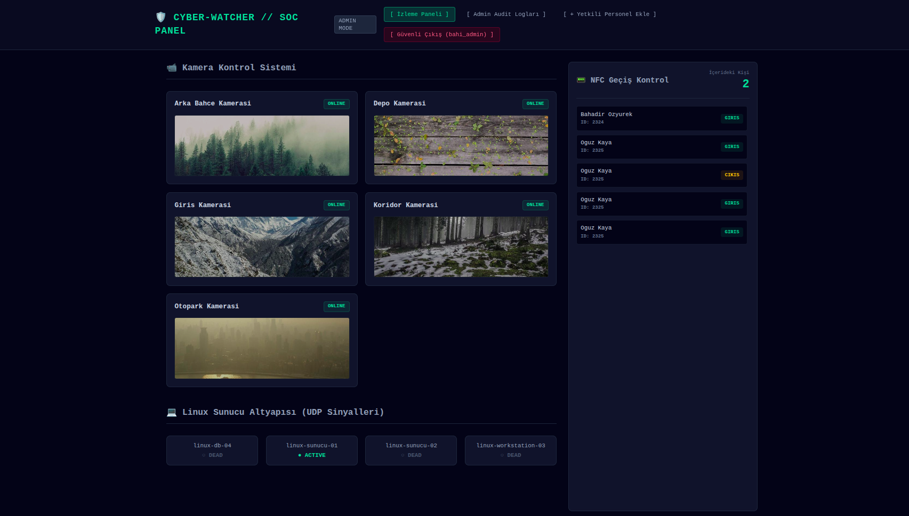

# Cyber-Watcher

Cyber-Watcher, bir **SOC (Security Operations Center)** ortamını simüle eden mikroservis tabanlı bir Proof of Concept (PoC) projesidir.

Sistem; NFC turnike olayları, IP kamera durumları ve Linux sunucu heartbeat verilerini merkezi bir panel üzerinden izleyerek temel güvenlik operasyonlarını simüle eder.

## Teknolojiler

- **Backend:** .NET 8 Minimal API
- **Frontend:** React + TypeScript + Vite
- **Database:** PostgreSQL 16
- **Message Broker:** RabbitMQ
- **ORM:** Entity Framework Core
- **Containerization:** Docker & Docker Compose

---

## Mimari

Bileşenler birbirleriyle doğrudan haberleşmek yerine RabbitMQ üzerinden asenkron mesajlaşır.

```text
NFC Service
             \
Camera Service ---> RabbitMQ ---> .NET API ---> PostgreSQL
             /
Linux Agent

                 │
                 ▼
           React Dashboard
```

Servisler:

- React Dashboard
- .NET API Gateway
- RabbitMQ
- PostgreSQL
- NFC Simulator
- Camera Simulator
- Linux Agent (UDP Heartbeat)

---

## Kurulum

Projeyi klonlayın.

```bash
git clone https://github.com/bahadirozyurek/siber-simulasyon-poc.git
cd siber-simulasyon-poc
```

Docker ile sistemi başlatın.

```bash
docker compose down -v
docker compose up --build -d
```

---

## Erişim

| Servis | Adres |
|---------|-------|
| React UI | http://localhost:5173 |
| API | http://localhost:8080 |
| RabbitMQ | http://localhost:15672 |

RabbitMQ

```
Kullanıcı: broker_user
Parola: BrokerSecurePass321!!
```

---

## Varsayılan Yönetici

```
Kullanıcı: bahi_admin
Parola: AdminPass123!
```

ADMIN rolü yeni kullanıcı oluşturabilir. Yetkilendirme API seviyesinde doğrulanmaktadır.

---

## Manuel Testler

### NFC Geçişi

```bash
echo "NFC-999,Ertugrul Aktas,GIRIS" >> /tmp/sim_sensors/nfc_pipe.txt
```

```bash
echo "NFC-999,Ertugrul Aktas,CIKIS" >> /tmp/sim_sensors/nfc_pipe.txt
```

### Linux Agent

Aktif

```bash
echo -n "linux-sunucu-01:AKTIF" | nc -u -w1 localhost 2222
```

Pasif

```bash
echo -n "linux-sunucu-01:PASIF" | nc -u -w1 localhost 2222
```

---

## Özellikler

- Mikroservis mimarisi
- RabbitMQ tabanlı asenkron haberleşme
- Docker Compose ile tek komut kurulum
- React tabanlı SOC paneli
- PostgreSQL veri kalıcılığı
- UDP heartbeat simülasyonu
- NFC turnike olay simülasyonu
- Rol tabanlı yetkilendirme (RBAC)
- Admin işlem logları (Audit Logging)

---

## Görsel
<p align="center">
  
</p>


---

## Not

Bu proje eğitim ve demonstrasyon amacıyla geliştirilmiş bir **Proof of Concept** çalışmasıdır. Gerçek bir SOC platformunun sadeleştirilmiş bir simülasyonunu sunmaktadır.
